# Obtaining API Keys from exchanges 🔑

## Overview
MM-KISS-Bot uses APIs from several exchanges to connect and interact with the exchange platforms. This allows MM-KISS-Bot to access real-time market data, place orders to buy and sell at specific prices and efficiently facilitate trading activities.

This guide will walk you through how to obtain API keys from Centralized and Decentralized exchanges so you can seamlessley connect them to your app.

## - Obtaining Binance API Key
Binance API allow developers to interact with its exchange, enabling them to access trading functions, market data, and manage their accounts through code.

### To generate your Binance API key:
**Step 1:**

Login to your [Binance account](https://www.binance.com/), click on the profile icon at the top-right corner of your dashboard, then select **[Account]**.

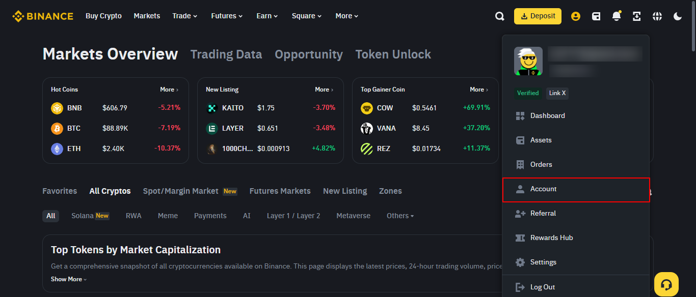

**Step 2:**

On the account menu, select **[API Management]**, then click the yellow **[Create API]** button.

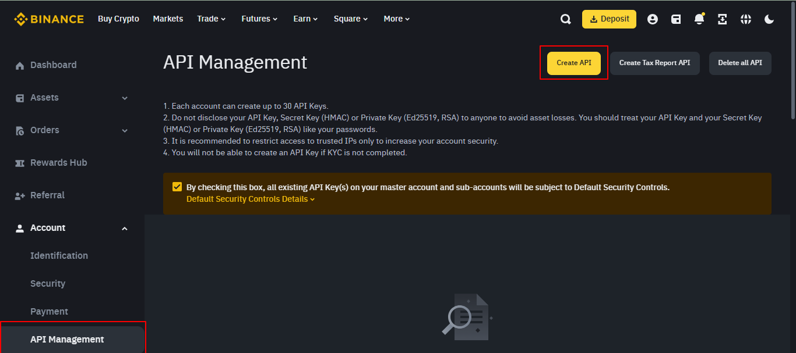

---
**NOTE**

**Please note that before creating an API Key, you need to:**

- Enable two-factor authentication (2FA) on your account;
- Make a deposit of any amount to your Spot Wallet to activate your account; and
- Verify your identity.

---

**Step 3:**

Select your prefered API key type

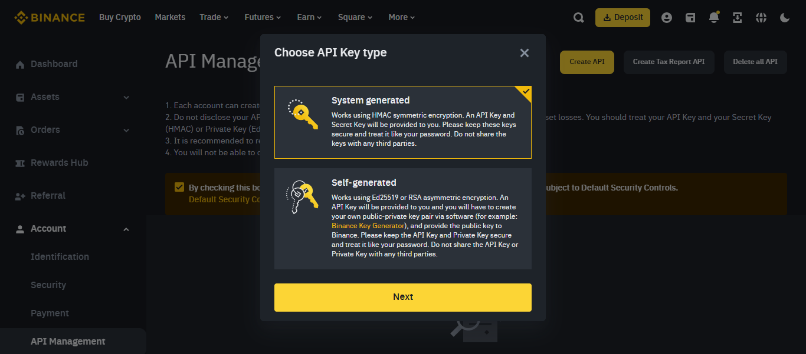

---
**NOTE**

**- System-generated API keys use HMAC symmetric encryption. You’ll get the API key and the Secret Key.** 

**- Self-generated API keys use Ed25519 or RSA asymmetric encryption. You’ll receive an API key, but you have to create your own public-private key pair via third-party software and provide the public key to Binance.**
---

**Step 4:**

Enter a label or name for your API Key, and click **Next**

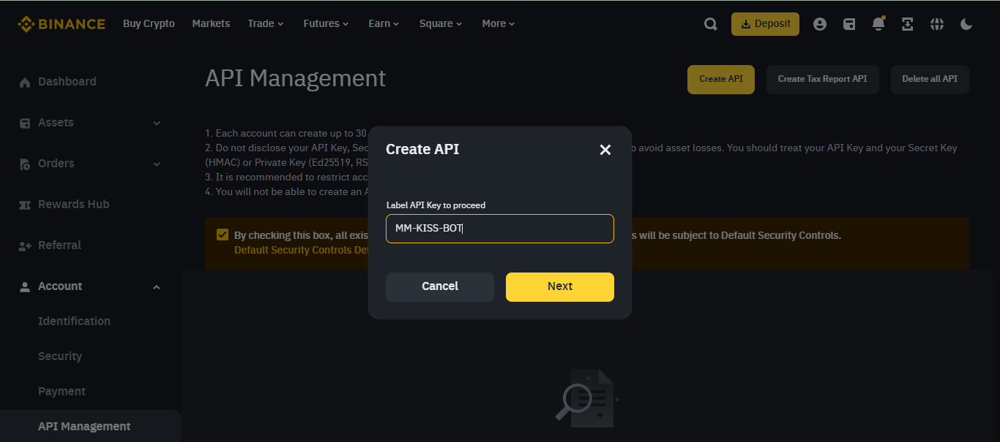

**Step 5:**
Verify with your 2FA devices and passkeys. Click on **Email** to recieve a verification code in your mail, then **phone number**, to recieve the code in your phone. Enter both code in the required input.

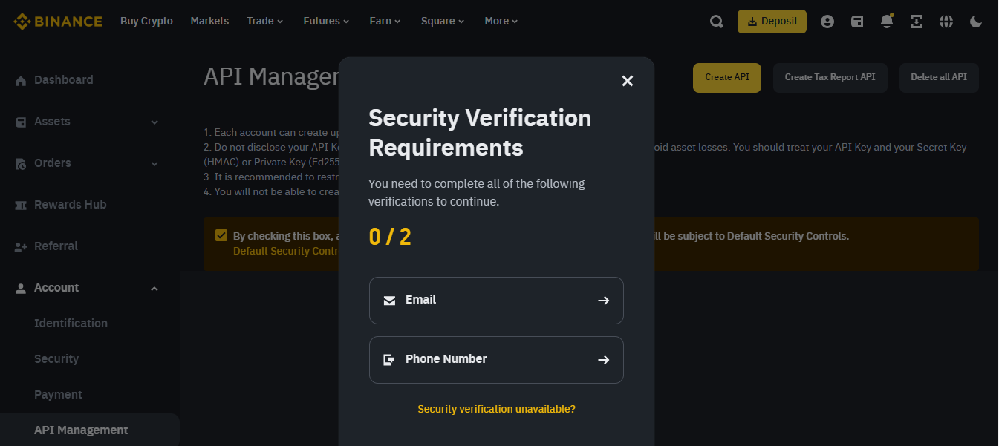

**Step 6:**
Your API key is now created. click the **[Edit]** button to modify the API permissions; and tick the **[Enable Spot & Margin Trading]** and **[Enable Futures]** options according to your needs.

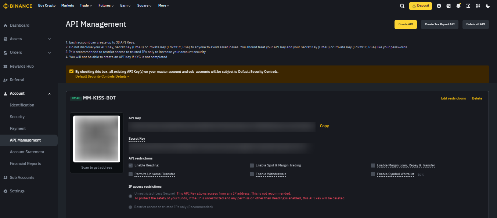

 

## - Obtaining BYBIT API Key

**Step 1:**

Login to your [BYBIT account](https://www.bing.com) and click on the profile icon at the top-right corner of your dashboard.

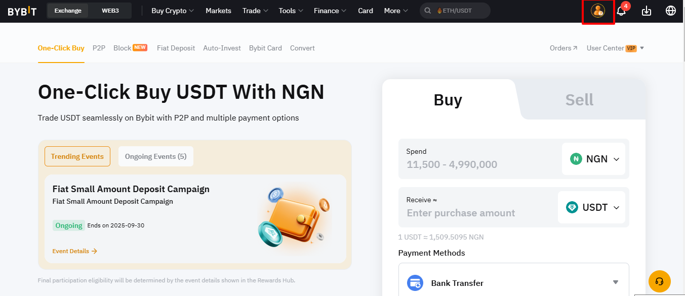

**Step 2:**

On the page that appears, select **[API]** on the side menu and click on the yellow **[create api key]** button at the top right.

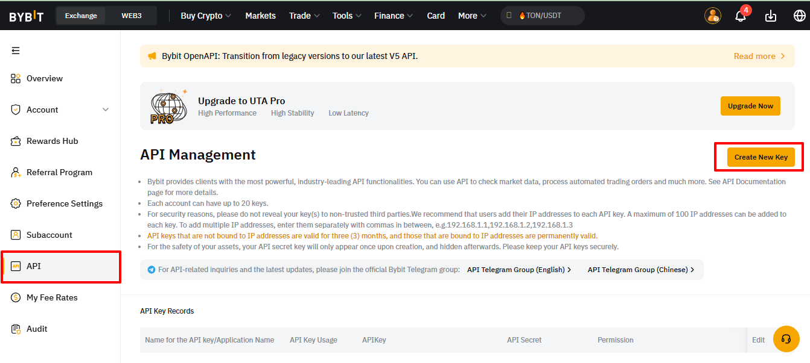

**Step 3:**

On the **[Select API Key Type]** prompt that appears, select **[System-generated API Keys]**. 

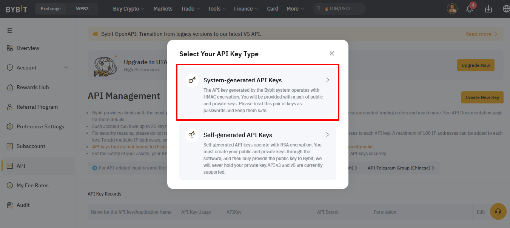

**Step 4:**

Configure permissions as required, and input MM-KISS-Bot's IP address in the required input.

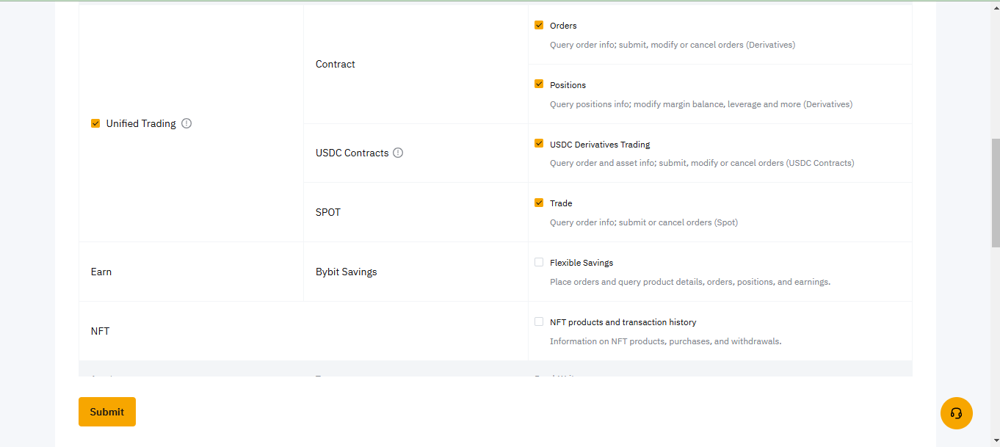
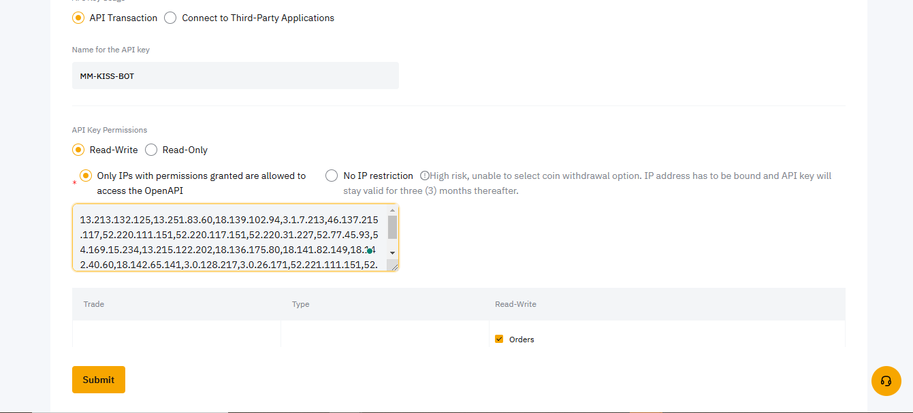

**Step 5:**

Enter the authentication code sent to your email and the code on your Google authenticator app respectively.

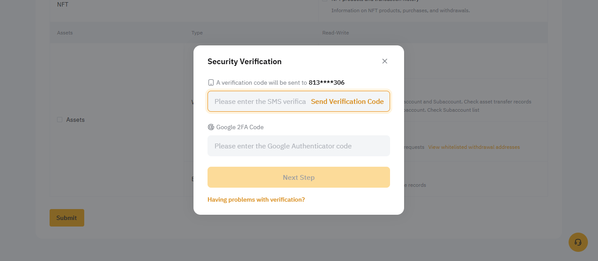

**Step 6:**

The API Secret code is shown only once. Copy and store the secret code safely.

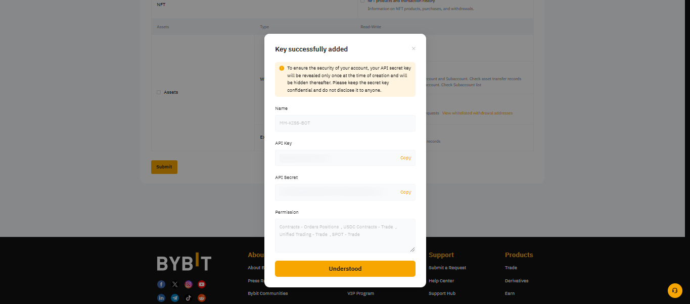
